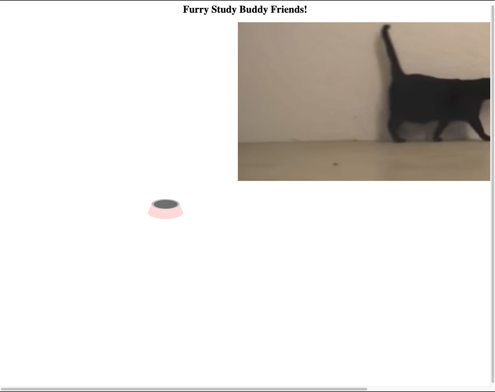

<h2>Description</h2>
This project is an attempt to create an online version of studying with a cat next to you – something that I find to be very calming and helps me focus. I implimented several different cat gifs and added interactive elements to make the cat feel like a calming study prescence, rather than a constant annoyance.

<h2>Challenges</h2>
I had used jQuery before, and I decided to utilize it for this project as well. I felt as though the difficult aspects of the project largely revolved around selecting and altering elements in the DOM with jQuery – I had to do a lot of supplimental reearch into the specific types of data returned. Additionally, it was difficult to find all the resources I needed, and I relied a lot on setTimeout functions when I think it would have been better to use async and await javascript functions. I hope to learn more about how to impliment those functions in this class in the future.

<h2>Sources</h2>
All the data used in this project were found on youtube and free sound databases.
